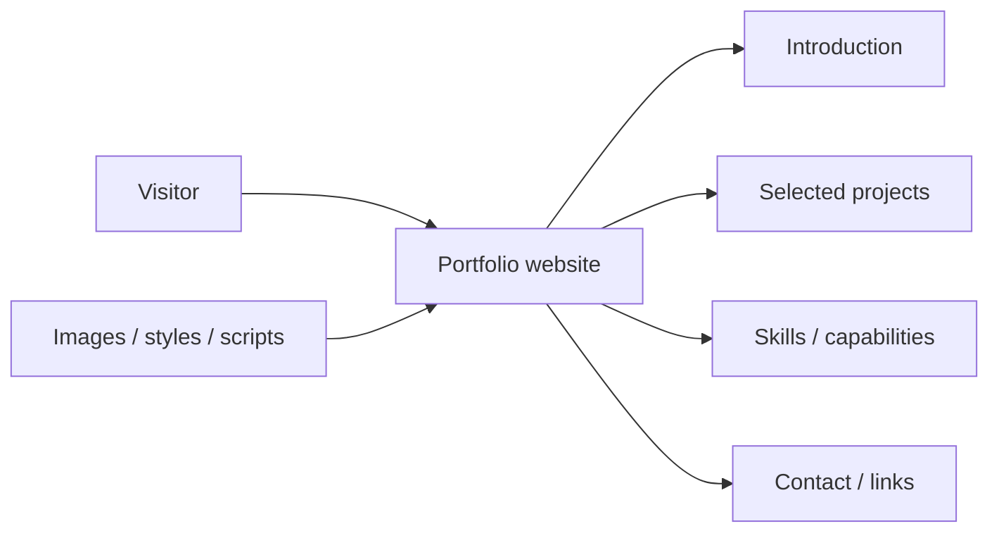
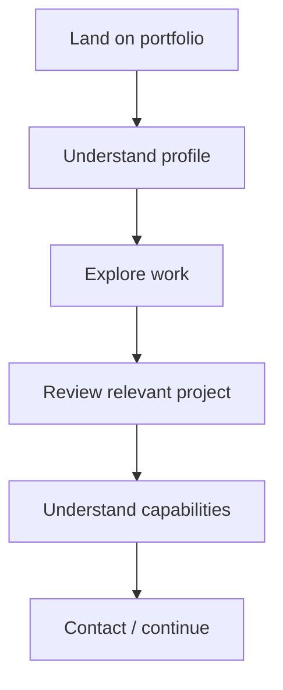
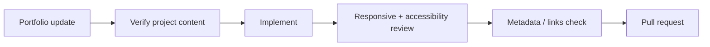

<div align="center">

# Personal Portfolio

**A portfolio website project for presenting selected work, skills, profile information, and contact paths in a clear responsive format.**


[Browse source](https://github.com/Nischhalsubba/Personal_Portfolio/tree/master) · [Issues](https://github.com/Nischhalsubba/Personal_Portfolio/issues)

</div>

## Overview

**Personal Portfolio** is documented so visitors, designers, and developers share one model of the experience: introduce the person, show useful work, provide enough context to understand capabilities, and make the next action obvious.

<details open>
<summary><strong>🏗️ Interactive portfolio architecture</strong></summary>



</details>

## Visitor flow



## Getting started

```bash
git clone https://github.com/Nischhalsubba/Personal_Portfolio.git
cd Personal_Portfolio
```

Use the runtime and package manager indicated by the repository's project files.

## Design & accessibility

Keep case-study or project information readable, use meaningful image alternatives, preserve keyboard navigation and visible focus, test narrow layouts, and keep decorative effects subordinate to project storytelling.

## SEO & discoverability

Use accurate portfolio, role, skill and project terminology in natural copy. Maintain unique page titles/descriptions, semantic headings, descriptive links, canonical URLs, social-preview metadata, and structured Person/CreativeWork data when appropriate.

## Contribution flow


