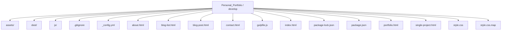
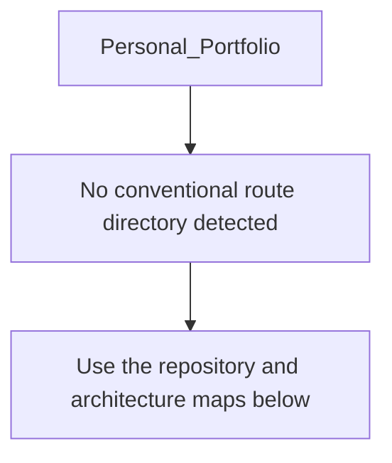
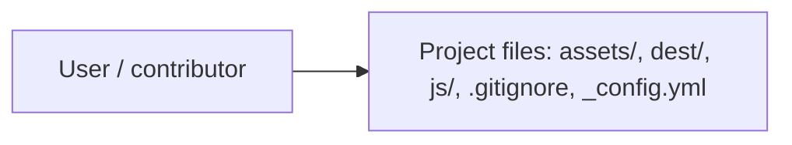
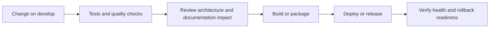
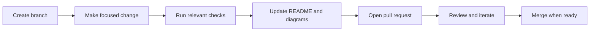

<!-- interactive-readme-standard:start -->

<div align="center">

# Personal_Portfolio

**Branch-aware technical guide for [`develop`](https://github.com/Nischhalsubba/Personal_Portfolio/tree/develop)**

<p>     </p>

<p>
  <a href="https://github.com/Nischhalsubba/Personal_Portfolio/tree/develop"><strong>Browse source</strong></a> ·
  <a href="https://github.com/Nischhalsubba/Personal_Portfolio/issues"><strong>Issues</strong></a> ·
  <a href="https://github.com/Nischhalsubba/Personal_Portfolio/codespaces/new?ref=develop"><strong>Open in Codespaces</strong></a>
</p>

</div>

> [!IMPORTANT]
> This guide is generated from the files actually present on `develop`. It links to detected source paths, preserves project-authored notes, and avoids claiming components that were not found.

## At a glance

| Item | Detected value |
|---|---|
| Purpose | A Sass project documented from the current branch structure and manifests. |
| Branch role | Compared with `master` |
| Stack | Sass, HTML, JavaScript, CSS |
| Manifests | package.json |
| Prerequisites | Node.js |
| Delivery | No conventional deployment configuration detected |
| License | No license file detected |

## Branch scope

This branch differs from the default branch in the following detected paths:

- [`README.md`](https://github.com/Nischhalsubba/Personal_Portfolio/blob/develop/README.md)
- [`about.html`](https://github.com/Nischhalsubba/Personal_Portfolio/blob/develop/about.html)
- [`assets/Images/.DS_Store`](https://github.com/Nischhalsubba/Personal_Portfolio/blob/develop/assets/Images/.DS_Store)
- [`assets/Images/favicon.png`](https://github.com/Nischhalsubba/Personal_Portfolio/blob/develop/assets/Images/favicon.png)
- [`assets/Images/image-placeholder-2.jpg`](https://github.com/Nischhalsubba/Personal_Portfolio/blob/develop/assets/Images/image-placeholder-2.jpg)
- [`assets/Images/image-placeholder.jpg`](https://github.com/Nischhalsubba/Personal_Portfolio/blob/develop/assets/Images/image-placeholder.jpg)
- [`assets/Images/logo.svg`](https://github.com/Nischhalsubba/Personal_Portfolio/blob/develop/assets/Images/logo.svg)
- [`assets/js/app.js`](https://github.com/Nischhalsubba/Personal_Portfolio/blob/develop/assets/js/app.js)
- [`assets/sass/base/_colors.scss`](https://github.com/Nischhalsubba/Personal_Portfolio/blob/develop/assets/sass/base/_colors.scss)
- [`assets/sass/component/_icons.scss`](https://github.com/Nischhalsubba/Personal_Portfolio/blob/develop/assets/sass/component/_icons.scss)
- [`assets/sass/component/_responsive.scss`](https://github.com/Nischhalsubba/Personal_Portfolio/blob/develop/assets/sass/component/_responsive.scss)
- [`assets/sass/pages/_home.scss`](https://github.com/Nischhalsubba/Personal_Portfolio/blob/develop/assets/sass/pages/_home.scss)

## Quick start

```bash
npm install
npm run test
```

### Configuration surface

- No committed environment example file was detected.

> Never commit secrets, private keys, production credentials, customer data, or unredacted infrastructure details.

## Repository map



| Responsibility | Detected source paths |
|---|---|
| Project files | [`assets/`](https://github.com/Nischhalsubba/Personal_Portfolio/tree/develop/assets/), [`dest/`](https://github.com/Nischhalsubba/Personal_Portfolio/tree/develop/dest/), [`js/`](https://github.com/Nischhalsubba/Personal_Portfolio/tree/develop/js/), [`.gitignore`](https://github.com/Nischhalsubba/Personal_Portfolio/blob/develop/.gitignore), [`_config.yml`](https://github.com/Nischhalsubba/Personal_Portfolio/blob/develop/_config.yml) |

## Website or application map



## Architecture and responsibility flow




## Quality, security, and operations

<table>
<tr>
<td width="33%" valign="top">

### Quality

- No conventional test directory was detected automatically.

Detected commands:
- `npm run test`

</td>
<td width="33%" valign="top">

### Security

- No dedicated security policy or automated dependency configuration was detected.

Review authentication, authorization, input validation, dependency updates, secret handling, and failure recovery before release.

</td>
<td width="34%" valign="top">

### Observability

- No dedicated observability integration was detected automatically.

Define useful logs, metrics, traces, alerts, and rollback signals for production-facing branches.

</td>
</tr>
</table>

## Delivery flow



### Automation detected

- No GitHub Actions workflow files were detected.

## Contribution flow



- Keep changes focused and explain architectural consequences.
- Run the checks relevant to the changed area.
- Update diagrams whenever routes, modules, data models, authentication, jobs, or delivery paths change.
- Add screenshots or recordings for visual behavior changes when useful.
- Use issues for reproducible defects and pull requests for reviewable changes.

## Ownership and support

| Topic | Source |
|---|---|
| Repository | [`Nischhalsubba/Personal_Portfolio`](https://github.com/Nischhalsubba/Personal_Portfolio) |
| Branch | [`develop`](https://github.com/Nischhalsubba/Personal_Portfolio/tree/develop) |
| Ownership | No CODEOWNERS file detected |
| Contributing | Use the contribution flow above |
| Support | [Open or review issues](https://github.com/Nischhalsubba/Personal_Portfolio/issues) |
| License | No license file detected |

<details>
<summary><strong>Documentation maintenance checklist</strong></summary>

- [ ] Purpose and branch scope are accurate.
- [ ] Setup and configuration commands still work.
- [ ] Repository, application, API, data, authentication, job, and deployment diagrams match the code.
- [ ] Tests, security controls, observability, and rollback behavior are documented.
- [ ] Links point to real files on this branch.
- [ ] No secrets or private operational details are exposed.

</details>

<!-- interactive-readme-standard:end -->

<!-- project-authored-notes:start -->
<details>
<summary><strong>Project-authored notes preserved from this branch</strong></summary>

# Personal_Portfolio

<div align="center">

</div>

<h1> Nischhal Personal Website - Static!  </h1>

</details>
<!-- project-authored-notes:end -->
