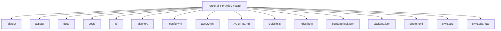
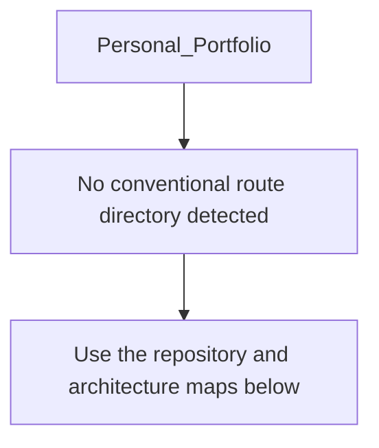
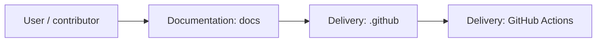
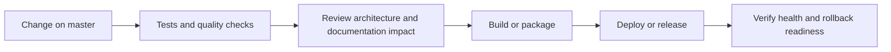
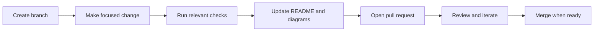

<!-- interactive-readme-standard:start -->

<div align="center">

# Personal_Portfolio

**Branch-aware technical guide for [`master`](https://github.com/Nischhalsubba/Personal_Portfolio/tree/master)**

<p>     </p>

<p>
  <a href="https://github.com/Nischhalsubba/Personal_Portfolio/tree/master"><strong>Browse source</strong></a> ·
  <a href="https://github.com/Nischhalsubba/Personal_Portfolio/issues"><strong>Issues</strong></a> ·
  <a href="https://github.com/Nischhalsubba/Personal_Portfolio/codespaces/new?ref=master"><strong>Open in Codespaces</strong></a>
</p>

</div>

> [!IMPORTANT]
> This guide is generated from the files actually present on `master`. It links to detected source paths, preserves project-authored notes, and avoids claiming components that were not found.

## At a glance

| Item | Detected value |
|---|---|
| Purpose | A Sass project documented from the current branch structure and manifests. |
| Branch role | Default branch |
| Stack | Sass, HTML, JavaScript, CSS |
| Manifests | package.json |
| Prerequisites | Node.js |
| Delivery | GitHub Actions |
| License | No license file detected |

## Branch scope

This is the repository's default branch.


## Quick start

```bash
npm install
npm run build
```

### Configuration surface

- No committed environment example file was detected.

> Never commit secrets, private keys, production credentials, customer data, or unredacted infrastructure details.

## Repository map



| Responsibility | Detected source paths |
|---|---|
| Documentation | [`docs`](https://github.com/Nischhalsubba/Personal_Portfolio/tree/master/docs) |
| Delivery | [`.github`](https://github.com/Nischhalsubba/Personal_Portfolio/tree/master/.github) |

## Website or application map



## Architecture and responsibility flow




## Quality, security, and operations

<table>
<tr>
<td width="33%" valign="top">

### Quality

- No conventional test directory was detected automatically.

Detected commands:
- `npm run build`

</td>
<td width="33%" valign="top">

### Security

- No dedicated security policy or automated dependency configuration was detected.

Review authentication, authorization, input validation, dependency updates, secret handling, and failure recovery before release.

</td>
<td width="34%" valign="top">

### Observability

- No dedicated observability integration was detected automatically.

Define useful logs, metrics, traces, alerts, and rollback signals for production-facing branches.

</td>
</tr>
</table>

## Delivery flow



### Automation detected

- [`.github/workflows/apply-interactive-readme.yml`](https://github.com/Nischhalsubba/Personal_Portfolio/blob/master/.github/workflows/apply-interactive-readme.yml)

## Contribution flow



- Keep changes focused and explain architectural consequences.
- Run the checks relevant to the changed area.
- Update diagrams whenever routes, modules, data models, authentication, jobs, or delivery paths change.
- Add screenshots or recordings for visual behavior changes when useful.
- Use issues for reproducible defects and pull requests for reviewable changes.

## Ownership and support

| Topic | Source |
|---|---|
| Repository | [`Nischhalsubba/Personal_Portfolio`](https://github.com/Nischhalsubba/Personal_Portfolio) |
| Branch | [`master`](https://github.com/Nischhalsubba/Personal_Portfolio/tree/master) |
| Ownership | No CODEOWNERS file detected |
| Contributing | Use the contribution flow above |
| Support | [Open or review issues](https://github.com/Nischhalsubba/Personal_Portfolio/issues) |
| License | No license file detected |

<details>
<summary><strong>Documentation maintenance checklist</strong></summary>

- [ ] Purpose and branch scope are accurate.
- [ ] Setup and configuration commands still work.
- [ ] Repository, application, API, data, authentication, job, and deployment diagrams match the code.
- [ ] Tests, security controls, observability, and rollback behavior are documented.
- [ ] Links point to real files on this branch.
- [ ] No secrets or private operational details are exposed.

</details>

<!-- interactive-readme-standard:end -->

<!-- project-authored-notes:start -->
<details>
<summary><strong>Project-authored notes preserved from this branch</strong></summary>

<div align="center">


# ✦ Nischhal Personal Portfolio

### Static UI/UX Portfolio Concept — 2021

**A minimal static personal portfolio website for Nischhal Raj Subba, built with HTML, compiled CSS, JavaScript, AnimXYZ animation utilities, Font Awesome icons, responsive navigation, particle background styling, project-preview sections, and editorial portfolio spacing.**


</div>

---

## ✨ Overview

**Personal_Portfolio** is an early static portfolio concept for **Nischhal Raj Subba**. The site introduces Nischhal as a UI/UX designer based in Nepal and presents a simple, minimal portfolio flow with a hero section, project preview blocks, navigation, footer links, and lightweight animation behavior.

This project reflects an earlier stage of personal portfolio exploration. It is useful as a learning marker because it shows a handcrafted static approach before newer portfolio systems, design-system thinking, and more advanced product-design case study structures.

---

## 🧭 Table of Contents

- [Project Purpose](#-project-purpose)
- [Designer’s Perspective](#-designers-perspective)
- [Page Structure](#-page-structure)
- [Features](#-features)
- [Tech Stack](#-tech-stack)
- [Repository Structure](#-repository-structure)
- [Run Locally](#-run-locally)
- [Deployment](#-deployment)
- [Quality Checklist](#-quality-checklist)
- [Modernization Roadmap](#-modernization-roadmap)

---

## 🎯 Project Purpose

The purpose of this repo is to create a lightweight personal portfolio website with a clean visual style and simple project storytelling.

The site communicates:

- personal identity
- UI/UX design positioning
- project preview layout direction
- simple navigation
- social/profile link areas
- early motion and interaction exploration

---

## 🎨 Designer’s Perspective

This portfolio is minimal and layout-focused. It uses generous spacing, large hero typography, simple project rows, and animation utility classes to create a clean digital presence.

From a design-growth point of view, this repo is important because it captures the early direction of Nischhal’s portfolio thinking:

- simple identity-first hero
- editorial project blocks
- clear navigation labels
- motion used for entrance and reveal
- lightweight static implementation

The current content still includes placeholder project names and example descriptions. Before using this publicly, those should be replaced with real case studies and current portfolio positioning.

---

## 🧱 Page Structure

| Section | Purpose |
|---|---|
| Header / Topnav | Logo, Work, About, Playground, Contact links |
| Hero | Introduces Nischhal and UI/UX positioning |
| Scroll cue | Down-arrow visual hint |
| Project Rows | Repeated project preview sections with description and image |
| Project Link | Link to `single.html` detail page |
| Footer | Name/date and social links |

---

## 🌟 Features

| Feature | Description |
|---|---|
| Static portfolio layout | Simple hand-coded HTML structure |
| Responsive navigation | Hamburger-style mobile nav trigger in JS |
| AnimXYZ effects | Fade/stagger animation utility classes |
| Particle background area | Decorative visual layer through `#particles` |
| Project preview rows | Reusable project storytelling blocks |
| External imagery | Random Unsplash placeholders for project visuals |
| Font stack | DM Sans and Inter from Google Fonts |
| Font Awesome icons | Navigation/menu icon support |

---

## 🛠 Tech Stack

| Layer | Technology | Purpose |
|---|---|---|
| Markup | HTML5 | Static structure |
| Styling | Compiled CSS in `dest/style.css` | Visual layout and responsive design |
| JavaScript | `js/app.js` | Navigation/interactions |
| Motion | AnimXYZ | Declarative animation utility classes |
| Icons | Font Awesome | Menu/icon support |
| Fonts | DM Sans + Inter | Typography system |

---

## 📁 Repository Structure

```text
.
├── index.html
├── about.html
├── single.html
├── assets/
│   └── Images/
├── dest/
│   └── style.css
├── js/
│   └── app.js
└── README.md
```

---

## 🚀 Run Locally

No build step is required for the current static output.

Open `index.html` directly in your browser or run a small local server:

```bash
python -m http.server 8000
```

Then open:

```text
http://127.0.0.1:8000/
```

---

## 🌐 Deployment

This project can be deployed to any static hosting platform:

- GitHub Pages
- Netlify
- Vercel
- Cloudflare Pages
- shared hosting

Keep `index.html`, `dest/`, `js/`, and `assets/` paths intact so the site loads correctly.

---

## ✅ Quality Checklist

### Content QA

- [ ] Replace placeholder project names.
- [ ] Replace placeholder sculpture/project copy with real design work.
- [ ] Replace random Unsplash images with actual project visuals.
- [ ] Update social links.
- [ ] Update footer year/content if needed.
- [ ] Confirm `about.html` and `single.html` are complete.

### Technical QA

- [ ] `index.html` loads correctly.
- [ ] `dest/style.css` loads correctly.
- [ ] `js/app.js` loads correctly.
- [ ] Mobile navigation works.
- [ ] AnimXYZ CSS loads from CDN.
- [ ] External images load or are replaced locally.

### Design QA

- [ ] Hero typography is readable on mobile.
- [ ] Project rows stack correctly on small screens.
- [ ] Motion does not distract from reading.
- [ ] Footer links are clear and usable.

---

## 🗺 Modernization Roadmap

- Replace placeholder content with real product-design case studies.
- Add SEO title and meta description.
- Add Open Graph preview image.
- Replace external/random images with optimized local assets.
- Add accessible alt text.
- Improve responsive project grid behavior.
- Add proper contact link or form.
- Update portfolio positioning from UI/UX learner to current product designer profile.

---

<div align="center">

An early static portfolio exploration documenting the foundation of Nischhal’s design journey.

</div>

</details>
<!-- project-authored-notes:end -->
