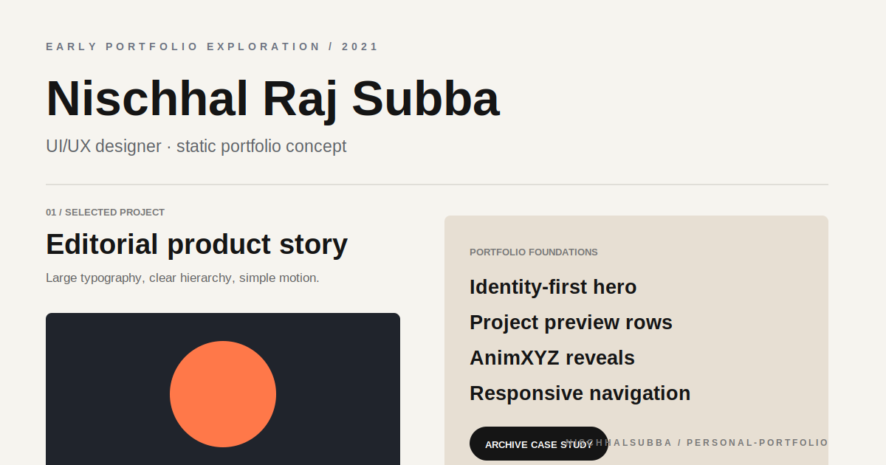

# Personal Portfolio Repository Overview

## Classification

An early 2021 static UI/UX portfolio experiment documenting an earlier stage of Nischhal's design and frontend growth.

- Stack: HTML, compiled CSS, JavaScript, AnimXYZ, Font Awesome
- Value: archive and learning-history project
- Current professional portfolio: should remain separate
- Fresh screenshot: not captured because public hosts were unreachable
- Visual above: local archival thumbnail, not a browser screenshot

## Highest-priority checks

1. Preserve the repository as an honest historical project.
2. Replace broken external images or links with local archival assets.
3. Remove current-professional claims that no longer match the 2021 context.
4. Test mobile navigation and animation fallbacks.
5. Mark placeholder projects clearly rather than presenting them as real client work.